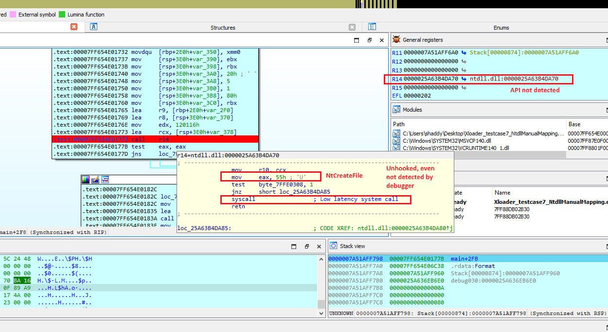

  
  <h1>Lagos Island Ntdll Unhooking Recreation</h1>

  
<i> <a href="https://cloud.google.com/blog/topics/threat-intelligence/formbook-malware-distribution-campaigns">Lagos Island ntdll unhooking</a></i>

     

### Introduction

This TTP has been extracted from Xloader4.3 malware. It reads Windows’ ntdll.dll module from disk into memory, and calls its exported functions directly, rendering user-mode hooking and API monitoring mechanisms ineffective. The malware author calls this technique "Lagos Island method" (allegedly originating from a userland rootkit with this name).

The procedure is performed in 3 steps:

1. Reading RAW ntdll from disk into memory
2. Allocating virtual memory and manually mapping ntdll headers/sections
3. Dynamically loading function addresses from clean unhooked dll

### Revere Engineering

<i>In the above screenshot, I have explained how APIs called by Lagos Island method are not recognized by either debugger or other API monitor tools. It manually finds the API addresses from the RWX buffer and execute those Native APIs with direct syscalls.</i>

   

In the code, the last API syscall is for **NtCreateFile**. It uses this API for creating an empty file in Public folder with the name "LagosIsland.txt". 

Disclaimer: For educational purposes only!

